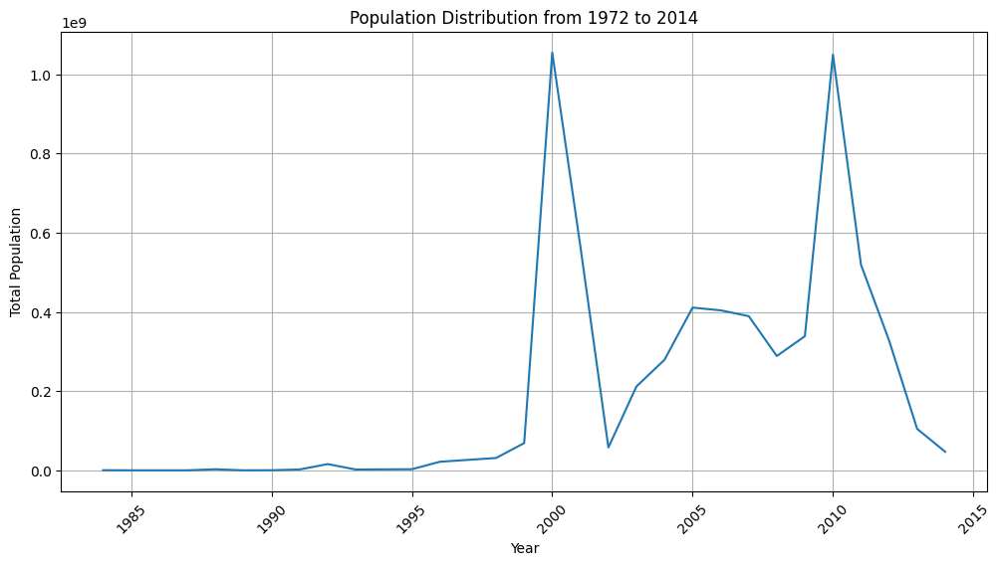
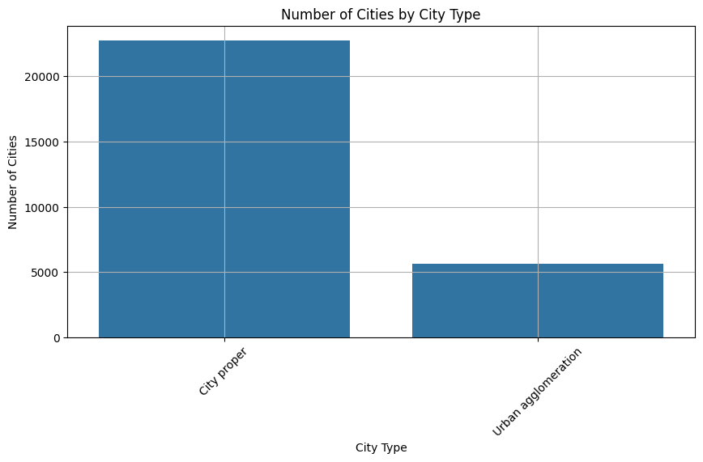
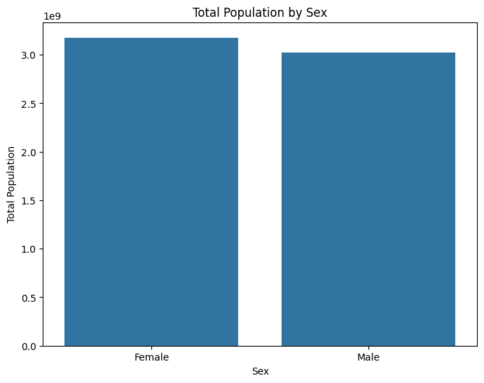
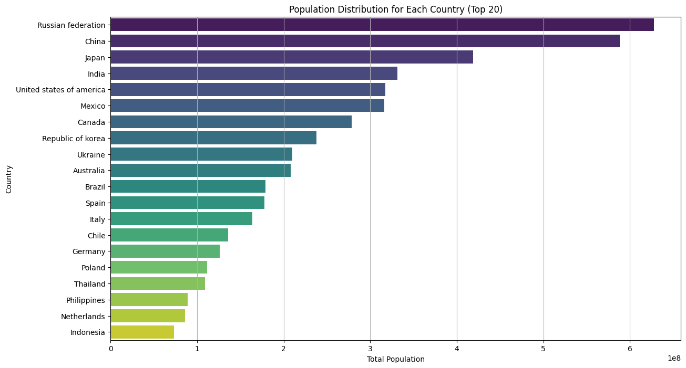
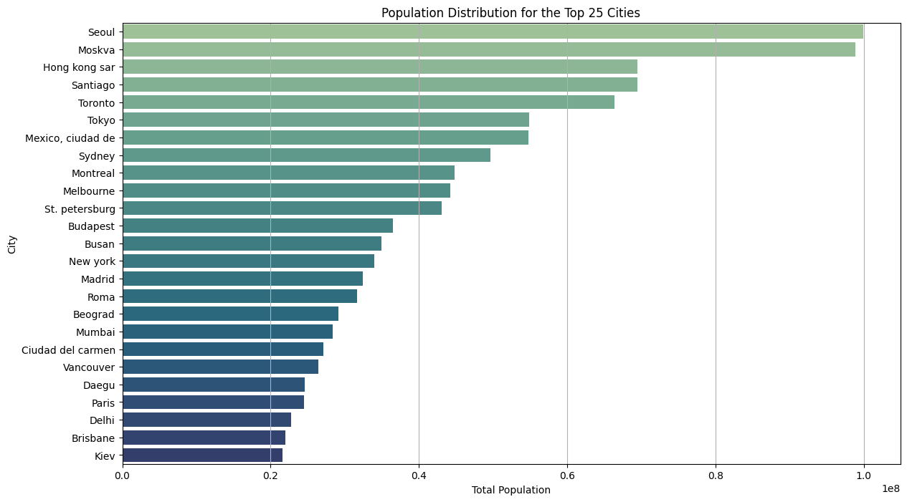

# City Population Annual Timeseries Analysis

## Project Description
This project analyzes the City Population Annual Timeseries dataset from the UN Statistics Division to understand population trends across cities from 1972 to 2014. The goal is to evaluate population changes over time, investigate population distributions by city type and sex, and develop predictive models for future population estimates.

## Dataset Description
The dataset consists of annual population data for various cities worldwide. It includes information such as the country or area, city names, city types, and population figures for the years 1972 to 2014. This comprehensive dataset allows for detailed analysis of urban population trends.

**Dataset URL:** [City Population Annual Timeseries](https://datahub.io/core/population-city?fbclid=IwY2xjawGJsmBleHRuA2FlbQIxMAABHXfm1mrv6NVaH0vvbkqC0jF1H_XqJRQwGqr_djIQs-VO3Ux4jJQ0MXwhwQ_aem_I4OfDifUf10bo9PDxAPPuQ#unsd-citypopulation-year-fm)
)

## Summary of Findings
The analysis revealed significant insights, including population growth patterns across different cities and the distribution of populations by city type. The Random Forest Regressor model demonstrated the best performance with a Mean Absolute Error of approximately 9.57 and an R² Score of about 95.61%, indicating high accuracy in predicting city populations.

## Data Preprocessing
Data preprocessing involved several key steps to clean and prepare the dataset for analysis. Unnecessary columns were removed, country names were standardized by capitalizing and cleaning special characters, and population figures were converted to integers. Additionally, rows with missing values were dropped to ensure data integrity.
- Dropped columns: Value Footnotes, Reliability, Record Type, Area, Source Year
- Handled missing values and renamed columns for clarity.
- Cleaned country and city names to standardize the dataset.

## Exploratory Data Analysis
- **Population Trends:** We visualized population growth trends over the years and found a steady increase in urban populations.
- **City Types Distribution:** Count plots illustrated the distribution of cities by type.

### Visualization

*This visualization illustrates the total population trend from 1972 to 2014, showing an overall increase in urban populations during this period.*

*This visualization presents the distribution of cities by type, indicating the predominant city types in the dataset.*

*This bar chart displays the total population divided by sex, highlighting gender distribution in the population.*

*This visualization shows the total population for the top 20 countries, providing insights into the largest urban populations worldwide.*

*This chart illustrates the population distribution for the top 25 cities, revealing the most populous urban areas.*

## Model Development
We employed four regression algorithms to predict city populations:
- Linear Regression
- Random Forest Regressor
- Decision Tree Regressor
- XGBoost Regressor

## Model Evaluation
Each model was evaluated using Mean Absolute Error (MAE) and R² Score. The Random Forest Regressor achieved the best performance:
- Mean Absolute Error: 9.57
- R² Score: 95.61%

## Conclusion
The project successfully demonstrated the ability to analyze and model city population data. The findings highlighted significant urbanization trends and the importance of effective data preprocessing and modeling techniques.
